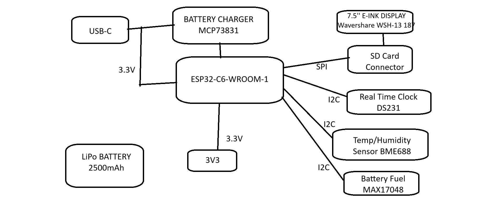

OpenBook e-book reader
Diaconu Oana-Ruxandra - 331CC

## Diagrama bloc

## BOM – Bill of Materials

| Componenta                                                | Link                                                                                             | Datasheet                                                                                                                              |
|:----------------------------------------------------------|:-------------------------------------------------------------------------------------------------|:---------------------------------------------------------------------------------------------------------------------------------------|
| 112A-TAAR-R03_ATTEND                                      | https://store.comet.bg/en/Catalogue/Product/43497/                                               | https://store.comet.bg/en/Catalogue/Product/43497/                                                                                     |
| 744043680IND_4828-WE-TPC_WRE                              | https://www.digikey.sg/en/models/1638515                                                         | https://www.digikey.sg/en/models/1638515                                                                                               |
| ADAFRUIT_LEDCHIP-LED0603                                  | https://www.snapeda.com/parts/KP-1608SURCK/Kingbright/view-part/?ref=search&t=LED%200603         | https://www.snapeda.com/parts/KP-1608SURCK/Kingbright/datasheet/                                                                       |
| BD5229G-TR                                                | https://componentsearchengine.com/part-view/BD5229G-TR/ROHM%20Semiconductor                      | https://componentsearchengine.com/part-view/BD5229G-TR/ROHM%20Semiconductor                                                            |
| BME680                                                    | https://www.snapeda.com/parts/BME680/Bosch/view-part/?welcome=home                               | https://www.snapeda.com/parts/BME680/Bosch%20Sensortec/datasheet/                                                                      |
| BUTTON_CUSYOMV1                                           | https://industry.panasonic.com/global/en/downloads?tab=cad&small_g_cd=203&part_no=EVQPUJ02K      | https://industry.panasonic.com/global/en/downloads?tab=catalog&small_g_cd=203&part_no=EVQPUJ02K                                        |
| CC0402MRX5R5BB106                                           | https://componentsearchengine.com/part-view/CC0402MRX5R5BB106/YAGEO      | https://componentsearchengine.com/part-view/CC0402MRX5R5BB106/YAGEO                                        |
| CPH3225A                                                  | https://www.snapeda.com/parts/CPH3225A/Seiko+Instruments/view-part/?ref=eda                      | https://www.snapeda.com/parts/CPH3225A/Seiko%20Instruments/datasheet/                                                                  |
| DS3231SN                                                  | https://www.snapeda.com/parts/DS3231SN%23/Analog+Devices/view-part/?ref=eda                      | https://www.snapeda.com/parts/DS3231SN%23/Analog%20Devices/datasheet/                                                                  |
| ESP32-C6-WROOM-1-N8                                       | https://www.snapeda.com/parts/ESP32-C6-WROOM-1-N8/Espressif+Systems/view-part/?ref=eda           | https://www.snapeda.com/parts/ESP32-C6-WROOM-1-N8/Espressif%20Systems/datasheet/                                                       |
| ESP32C6_VARISTORCN1812                                    | https://www.mouser.co.uk/ProductDetail/EPCOS-TDK/B72520T0350K062                                 | https://www.mouser.co.uk/ProductDetail/EPCOS-TDK/B72520T0350K062                                                      |
| ESP32_WROVER_BME680_BME680                                | https://www.snapeda.com/parts/BME680/Bosch/view-part/?welcome=home                               | https://www.snapeda.com/parts/BME680/Bosch%20Sensortec/datasheet/                                                                      |
| ESP32_WROVER_EAGLE-LTSPICE_CC0402                         | https://componentsearchengine.com/part-view/CC0402MRX5R5BB106/YAGEO                              | https://componentsearchengine.com/Datasheets/2/CC0402MRX5R5BB106.pdf                                                                   |
| ESP32_WROVER_EAGLE-LTSPICE_RR0402                         | https://www.snapeda.com/parts/RC0402FR-07226RL/Yageo/view-part/                                  | https://www.snapeda.com/parts/RC0402FR-07226RL/Yageo/datasheet/                                                                        |
| ESP32_WROVER_SPARKFUN-DISCRETESEMI_MOSFET_PCH-DMG2305UX-7 | https://componentsearchengine.com/part-view/DMG2305UX-7/Diodes%20Incorporated                    | https://componentsearchengine.com/part-view/DMG2305UX-7/Diodes%20Incorporated                                                                                |
| FH34SRJ-24S-0.5SH_99_                                     | https://componentsearchengine.com/part-view/XC6220A331MR-G/Torex                                 |  https://componentsearchengine.com/part-view/XC6220A331MR-G/Torex                                                                           |
| MAX17048G+T10                                             | https://www.snapeda.com/parts/MAX17048G+T10/Analog+Devices/view-part/?ref=eda                    | https://www.snapeda.com/parts/MAX17048G+T10/Analog%20Devices/datasheet/                                                                |
| MBR0530                                                   | https://ro.mouser.com/ProductDetail/KYOCERA-AVX/SD0805S020S1R0                                   | https://ro.mouser.com/datasheet/2/40/schottky-3165252.pdf                                                                              |
| MCP73831                                                  | https://www.digikey.com/en/models/1874108                                                        | https://www.digikey.com/en/models/1874108 |
| PGB1010603MR                                              | https://www.snapeda.com/parts/PGB1010603MR/Littelfuse/view-part/?ref=eda                         | https://www.snapeda.com/parts/PGB1010603MR/Littelfuse%20Inc./datasheet/                                                                |
| QWIIC_CONNECTORJS-1MM                                     | https://www.snapeda.com/parts/PRT-14417/SparkFun/view-part/                                      | https://www.snapeda.com/parts/PRT-14417/SparkFun%20Electronics/datasheet/                                                              |
| SAMACSYS_PARTS_USB4110-GF-A                               | https://componentsearchengine.com/part-view/USB4110-GF-A/GCT%20(GLOBAL%20CONNECTOR%20TECHNOLOGY) | https://componentsearchengine.com/part-view/USB4110-GF-A/GCT%20(GLOBAL%20CONNECTOR%20TECHNOLOGY)                                                                                              |
| SI1308EDL-T1-GE3                                          | https://componentsearchengine.com/part-view/SI1308EDL-T1-GE3/Vishay                              | https://componentsearchengine.com/Datasheets/1/SI1308EDL-T1-GE3.pdf                                                                    |
| SJ                                                        | https://grabcad.com/library/solder-jumpers-1                                                     | https://grabcad.com/library/solder-jumpers-1                                                                                           |
| USBLC6-2SC6Y                                              | https://www.snapeda.com/parts/USBLC6-2SC6Y/STMicroelectronics/view-part/?ref=eda                 | https://www.snapeda.com/parts/USBLC6-2SC6Y/STMicroelectronics/datasheet/                                                               |
| W25Q512JVEIQ                                              | https://www.snapeda.com/parts/W25Q512JVEIQ/Winbond+Electronics/view-part/?ref=eda                | https://www.snapeda.com/parts/W25Q512JVEIQ/Winbond%20Electronics/datasheet/                                                            |
| XC6220A331MR-G                                            | https://componentsearchengine.com/part-view/XC6220A331MR-G/Torex                                 | https://componentsearchengine.com/part-view/XC6220A331MR-G/Torex                                                                           |

## Descriere functionalitati hardware

###  **E-paper Display**
  - Conectat prin pinii MOSI, SCK, CS, DC, BUSY, RST
  - Permite afișarea conținutului static cu consum energetic extrem de redus
  
###  **SD Card**
  - Conectat prin CS, MOSI, MISO, SCK
  - Utilizat pentru stocarea cărților electronice și a configurațiilor

###  **Baterie Li-Po + Fuel Gauge**
  - Alimentarea principală a sistemului, conectată direct prin paduri la PCB
  - Monitorizată prin MAX17048G+T10 conectat pe I2C (SDA, SCL)

###  **BME688**
  - Senzor ambiental pentru temperatură, presiune, umiditate și gaze
  - Comunică prin aceiași pini I2C ca RTC și Fuel Gauge

###  **RTC** 
  - Oferă timp real precis, cu pin INT pentru întreruperi și pin de reset 
  - Alimentat separat prin VRTC

###  **Butoane fizice**
  - BOOT, IO_CHANGE și RESET
  - Permite controlul funcțiilor precum trecerea între pagini, pornirea dispozitivului, sau activarea bootloader-ului pentru upload firmware

###  **USB-C Conector**
  - Permite programarea și încărcarea dispozitivului.
  - Include protecții ESD și varistor pentru protecția circuitului.

### Specificații de comunicație:

- **SPI** pentru SD card, display și memorie NOR Flash.
- **I2C** pentru RTC, senzor BME688 și fuel gauge.
- **UART** pentru debug sau comunicație serială externă.

### Estimare consum:

- În regim activ: între 80–150 mA (în funcție de e-paper și senzorii activi).
- În standby (deep sleep): sub 1 mA.
- Display-ul e-paper nu consumă curent în regim static – doar la refresh.

## Corespondenta pini ESP32-C6 - restul componentelor

| Pin ESP32-C6 | Nume net / semnal     | Componentă asociată        | Funcție / Motivare                                  |
|--------------|------------------------|-----------------------------|-----------------------------------------------------|
| GPIO0        | IO/BOOT                | Buton BOOT                  | Activare bootloader pentru flash                    |
| GPIO1        | SS_SD                  | SD Card                     | Chip select pentru card SD                          |
| GPIO3        | MOSI                   | SD Card + E-Paper           | Comunicare SPI                                      |
| GPIO4        | MISO                   | SD Card                     | Citire date SPI                                     |
| GPIO5        | SCK                    | SD Card + E-Paper           | Clock SPI                                           |
| GPIO6        | EPD_CS                 | E-Paper Display             | Selectare ecran SPI                                 |
| GPIO7        | EPD_DC                 | E-Paper Display             | Data/Command pentru ecran                           |
| GPIO8        | EPD_BUSY               | E-Paper Display             | Semnal BUSY de la ecran                             |
| GPIO9        | EPD_RST                | E-Paper Display             | Reset hardware ecran                                |
| GPIO10       | FLASH_CS               | NOR Flash W25Q512           | Chip select memorie SPI                             |
| GPIO16       | TXD0                   | UART Serial                 | Transmisie serială                                  |
| GPIO17       | RXD0                   | UART Serial                 | Recepție serială                                    |
| GPIO18       | SDA                    | RTC, BME688, Fuel Gauge     | I2C Data                                            |
| GPIO19       | SCL                    | RTC, BME688, Fuel Gauge     | I2C Clock                                           |
| GPIO20       | INT_RTC                | RTC                         | Interrupere alarmă                                  |
| GPIO21       | IO/CHANGE              | Buton IO_CHANGE             | Detecție apăsare buton                              |
| GPIO22       | RTC_RST                | RTC                         | Reset RTC                                           |
| GPIO23       | VRTC                   | RTC                         | Tensiune RTC                                        |
| GPIO44       | RESE                   | Reset ESP / Sisteme externe | Reset logic suplimentar                             |
| GPIO45       | GDR                    | E-Paper Driver              | Gate Driver enable                                  |

